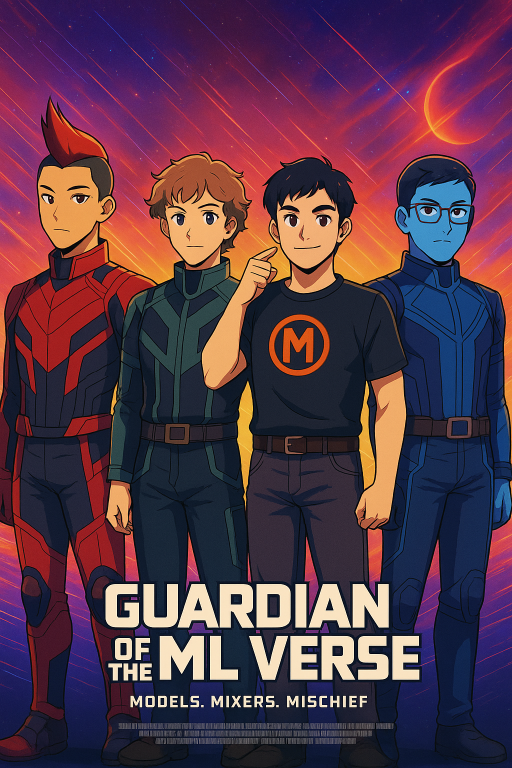

# ml-guardrails-project
semester project for 257-ml

# contributors

1. adv ( Advait Shinde )
2. jasss ( Jasper Morgal )
3. toneyyyyy ( Toney Zhen )
4. nickk ( Nickzad Bayati )

# about the project

Guardrails:
- Input: Sensitive Data (Toney Zhen)
- Input: Prompt Injection (Advait Shinde)
- Output: General Malicious Output (Jasper Morgal)
- Output: Toxicity (Nickzad Bayati)
